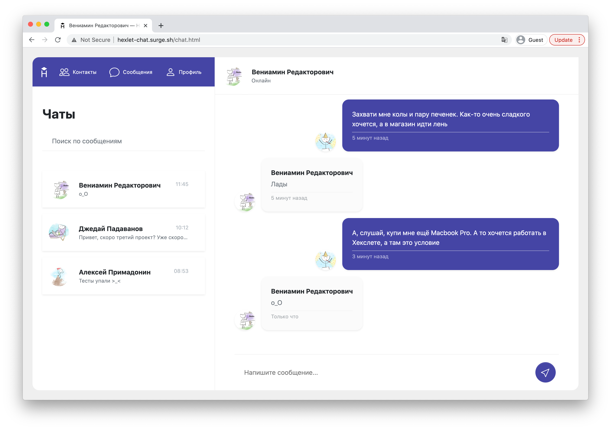

<div align="center">
  
</div>

## About Chat Messenger

The whole project is automated using the Gulp task manager, which watches for changes in files and automatically compiles
Pug, SASS, minify HTML and optimize images. The project created custom components and utilities based on Bootstrap.

## About project

This pet-project was created as part of the [Hexlet](https://ru.hexlet.io/programs/layout-designer/projects/59) curriculum.

## Getting started

```sh
git clone https://github.com/DmitriyK/layout-chat-messenger.git
cd layout-chat-messenger/
make install
make start
```

## Run lint

```sh
make lint
```

## Surge

https://layout-chat-messenger.surge.sh